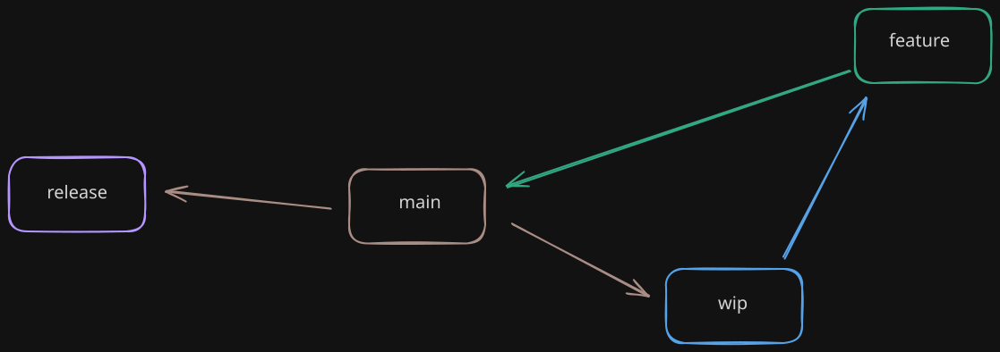

# Building
How the sausage is made.

* [Overview](#overview)
* [Running tasks](#running-tasks)
* [Branching](#branching)
* [Misc](#misc)


## Overview
Each build is for a _target_ , _area_ and _objective_

- A _target_ is the host or platform the files are accessed from in the browser.
	- Usually a shorthand, codename or mascot
		- `octocat == github pages`
		- `jammy == netlify`
		- `tanuki == gitlab`
- An _area_ represents a variation of the target
	- fhost = file host (ex: `file://`)
	- lhost = local host (ex: `http://localhost:8080`)
	- staging = staging/test host (ex: `http://dev.somesite`)
	- prod = real host (ex: `https://somesite`)
- An _objective_ represents the version


### Directory structure:
```
build
└── target
    └── objective
    		├── _general_file
    		├── area1_somefile
    		├── area2_otherfile
    		├── area3_afile
    		└── area4_anotherfile
```


## Running tasks
Using [task](https://taskfile.dev/) as the build tool. The tasks will typically have some _action_ verb associated like building or tearing down, the commands for running tasks will look something like:
```
task TARGET:OBJECTIVE:action-AREA
```
So to build the github pages demo for testing locally without a server:
```
task octocat:v0:rear-fhost
```


## Branching
Three main categories of branches:
* main -> Only one
	- updated from the _feature_ branches
* wip -> Only one
	* - updated from the _main_ branch 
* feature -> One for each thing/campaign being worked on
	* updated from wip
* release -> One for each _target_
	- updated from the _main_ branch




## Misc
### js
Using rollup to bundle scripts
copying vendor files into the directory to be served (no bundles)

### css
Using Stylus and PostCSS to pre-process and bundle styles respectively

### html
Using Pug to render markup:
	* use json file for template variables (like _area_ relative urls or font urls)

### metadata
Things like:
	* images
	* favicon
	* pwa stuff
